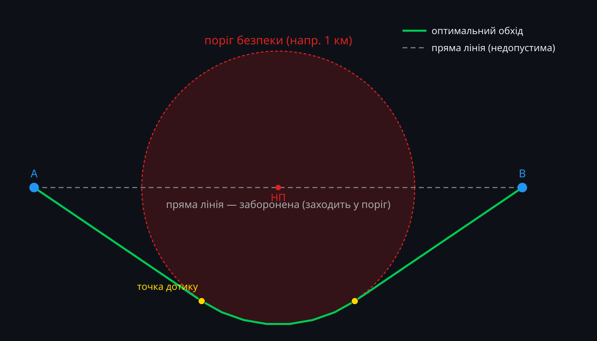
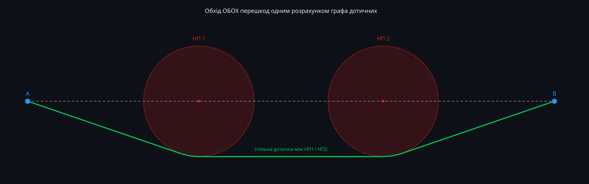

# Planning a Route That Keeps Its Distance From Populated Areas

Mission Analyzer already has a feature that checks how close an ArduPilot
mission route passes to populated areas — it looks up settlements from
OpenStreetMap, computes the distance from each mission leg to the nearest
one, and flags anything closer than a configurable threshold.

Detecting the problem is only half the job. This post lays out how we're
solving the other half: automatically reshaping a route so that it no
longer violates the threshold, without turning the mission into a mess of
waypoints or accidentally introducing a *new* violation while fixing an
old one.

Code isn't public yet — this post is deliberately just the problem
statement and the method, so the reasoning is on record before the
implementation lands.

## What "better" means here

Before writing any pathfinding code, we had to pin down exactly what is
being optimized, because it's easy to reach for the wrong objective.

Two objectives that sound reasonable but are actually wrong for this job:

- **Sum of distances to every settlement** — this would push the route as
  far from *everything* as possible, everywhere, which isn't what anyone
  wants. A leg passing 5 km from a village isn't "worse" than one passing
  50 km away; both are fine once they clear the threshold.
- **Sum of squared distances** — same problem, just a different curve.

The actual criterion is much simpler: **minimize total route length**,
subject to a hard constraint — no part of the path may come closer than
`threshold_km` to any settlement (except the immediate approach to the
landing point, where flying near a populated area is often unavoidable
and is deliberately excluded from this optimization).

Settlements aren't a term in the cost function. They're forbidden zones
that *filter* which paths are even legal. Among all legal paths between
two waypoints, we want the shortest one — nothing more, nothing less.

Fuel is handled the same way: it's a **hard feasibility check**, run
*after* the shortest legal route is found, not something the optimizer
tries to minimize. A route 200 m longer than strictly necessary costs
nothing extra to accept, as long as it fits the tank.

## Why not just nudge waypoints around, one at a time?

The obvious first instinct — "found a violation, insert a point that
pushes the leg away from that settlement" — has a real failure mode: the
detour you just inserted can pass close enough to a *different*
settlement that wasn't a problem for the original straight line. Fix
that one, and a third might show up. There's no guarantee this process
terminates cleanly, and even when it does, there's no reason to believe
the result is the *shortest* legal path — just *a* legal path, stumbled
into by trial and error.

We didn't want to invent an ad-hoc fix for this. It turns out the
underlying problem — shortest path between two points while staying
outside a set of circular exclusion zones — is a well-studied problem in
computational geometry, going back to Rohnert's 1986 paper on shortest
paths around convex obstacles, with more recent work specifically on
disk-shaped obstacles. There's no need to reinvent it.

## The method: tangent visibility graph

Model every relevant settlement as a **circle** — center at the
settlement's coordinates, radius equal to the safety threshold. A leg
that runs straight from waypoint A to waypoint B is invalid exactly when
that line passes through one of these circles.

The shortest path that avoids a circular obstacle **hugs its boundary**:
it travels in a straight line, touches the circle *tangentially*, follows
the circle's edge for as long as necessary, then leaves tangentially
again toward the destination. This is the same shape a taut string would
take if pinned at A and B and pulled around a physical disk sitting
between them.

*A is blocked from reaching B in a straight line by the safety circle
around the settlement. The shortest legal path touches the circle at two
tangent points and follows its edge between them.*

To find this automatically, we build a graph:

- **Nodes**: the start point, the end point, and the tangent points
  where a straight line from any node can just touch a circle without
  crossing it.
- **Edges**: straight tangent segments between nodes (rejected if they
  cut through some *other* circle), plus arc segments connecting
  neighboring tangent points around the same circle's boundary.

Running Dijkstra's algorithm over this graph gives the shortest path
that avoids every obstacle in it — not one at a time, but all of them
**simultaneously**, in a single pass. That's the direct answer to the
"fixing one settlement creates a new violation" problem: there's no
sequence of local patches, so there's nothing for a later obstacle to
sneak past unnoticed. Every settlement close enough to matter is already
a node in the same graph the shortest path is computed over.

## Multiple obstacles in a row

The same graph construction handles a chain of settlements between two
waypoints without any special-casing: circles that block each other's
direct tangent lines get connected via a shared external tangent instead,
and the shortest path threads through whichever combination of tangents
and arcs is actually shortest.

*Two safety circles sit between A and B. The optimizer finds a single
path that clears both, using a shared tangent line where the two circles
are close enough that going around them separately would be wasteful.*

## Turning a path into waypoints

ArduPilot missions fly straight lines between waypoints — there's no
native "follow this arc" command for ordinary navigation. So the curved
arc segments from the graph get discretized into a handful of short
straight sub-segments before being written back as waypoints.

There's a subtlety worth mentioning: a straight chord between two points
that both sit exactly on the safety circle will always cut slightly
*inside* that circle — basic geometry, unavoidable for any chord of
non-zero length. We compensate by placing the subdivision points a few
meters further out than the true radius, using the exact amount needed
so the resulting chord's closest approach to the center lands precisely
back on the real threshold distance, not inside it.

## Two hard limits, checked after the fact

**Fuel.** We ask the operator once, before running the optimization, for
tank capacity and average cruise consumption. Required fuel is trip fuel
plus a reserve computed from the ICAO Annex 6 contingency rule: the
greater of 5% of trip fuel or five minutes at cruise consumption. If the
optimized route doesn't fit the tank, the tool says so — it does not try
to shorten the detour to make it fit; that decision stays with the
operator.

**Waypoint count.** ArduPilot's own documentation puts the practical
mission storage limit at roughly 650 items on modern boards. We cap
generated routes at 255 waypoints — a conservative budget that leaves
headroom for everything else already in the mission (home, takeoff,
landing, DO_-commands) on boards less capable than the one it was
developed against.

Neither limit stops the optimizer mid-route. It always finishes
processing every leg, then reports whether either limit was exceeded, so
the operator sees the complete picture — including exactly which legs, if
any, couldn't be resolved automatically — rather than a partial result
with no explanation.

## Status

The geometry described above — tangent points, the graph construction,
Dijkstra over it, arc subdivision with the sagitta correction, fuel
check, waypoint-limit accounting — is implemented and passing numeric
tests, including on a real ~615 km test mission with real settlement
data. What's left is wiring it into Mission Analyzer's UI: a button, a
before/after map, and a numeric summary of what changed.

Code is coming in a few days. This post exists so the reasoning behind
the approach is written down and searchable before that happens.
